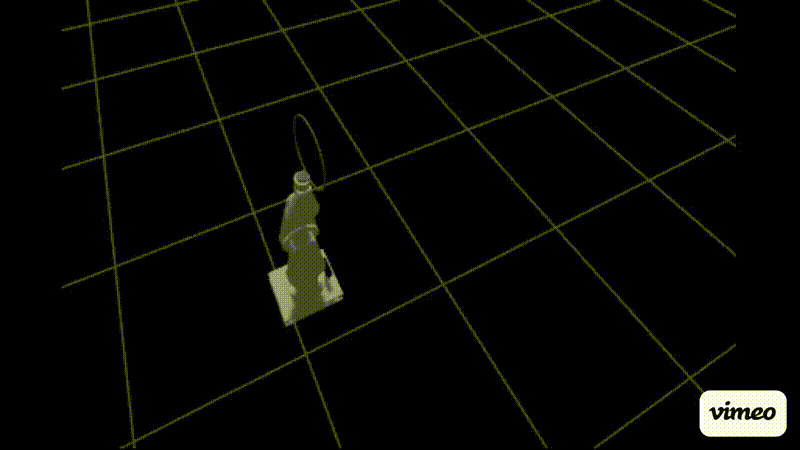

# 5-DOF Ball Interception Robotic Arm

A full-stack robotics project demonstrating real-time dynamic ball interception using a custom-designed 5-DOF robotic arm. The system integrates mechanical design, simulation, computer vision, trajectory prediction, and inverse kinematics into a complete autonomous interception pipeline.


*The arm detects an incoming ball via depth camera, predicts its trajectory using a Kalman filter, and positions the hoop end effector to intercept it in real time.*
---

## Project Overview

| Layer | Technology |
|---|---|
| CAD | SolidWorks (exported to URDF via sw2urdf) |
| Simulation | Gazebo Harmonic |
| Robot Framework | ROS2 Jazzy |
| Joint Control | ros2_control + JointTrajectoryController |
| Perception | OpenCV HSV detection + PointCloud2 depth |
| Prediction | Kalman filter + least-squares regression |
| Kinematics | Geometric analytical IK |
| Language | Python 3.12 |

---

## Mechanical Design

The arm was designed in SolidWorks with a focus on high-speed dynamic interception. All links use an oblong PETG profile for stiffness-to-weight ratio. The base uses a belt drive system with an RU124 cross-roller bearing for smooth continuous yaw rotation.

### Degrees of Freedom

| Joint | Type | Actuator | Peak Torque |
|---|---|---|---|
| J0 BaseYaw | Continuous | Flipsky 6374 140KV + HTD 5M belt | — |
| J1 ShoulderPitch | Revolute ±90° | CubeMars AK70-10 | 24.8 Nm |
| J2 ElbowPitch | Revolute ±90° | CubeMars AK60-6 V3.0 | 9.0 Nm |
| J3 WristPitch | Revolute ±90° | CubeMars AK40-10 | 4.1 Nm |
| J4 HoopRotate | Continuous | CubeMars AK40-10 | 4.1 Nm |

### Link Lengths

```
L1 (base to shoulder):  0.207 m
L2 (shoulder to elbow): 0.250 m
L3 (elbow to wrist):    0.250 m
L4 (wrist to hoop):     0.184 m
Max reach:              0.684 m
```

### End Effector

235mm diameter hoop with a simulated net (zero-bounce, high-friction collision cylinder) that catches the ball on contact and prevents it from bouncing out.

---

## Software Architecture

```
Gazebo Simulation
      │
      ├── /camera/color/image_raw      ──► ball_detector.py
      ├── /camera/depth/image_raw/points──► ball_detector.py
      │
      └── ball_detector.py
              │ /ball_position (camera_optical frame)
              ▼
      trajectory_predictor.py
              │  TF: camera_optical → world
              │  Kalman filter [x,y,z,vx,vy,vz]
              │  Least-squares velocity regression
              │  Parabolic intercept prediction
              │ /ball_intercept_point (world frame)
              ▼
      ik_solver.py
              │  Confidence gating (stable prediction window)
              │  Geometric analytical IK
              │  Corrected joint direction signs
              │ /arm_controller/joint_trajectory
              ▼
      JointTrajectoryController
              │
              └── Gazebo physics simulation
```

---

## Perception Pipeline

### Ball Detection (`scripts/ball_detector.py`)

- Subscribes to `/camera/color/image_raw` and `/camera/depth/image_raw/points`
- Detects orange ball using dual HSV masks (normal + shadow range)
- Samples a 5×5 pixel patch around the detected centroid for robust depth
- Reads raw PointCloud2 bytes directly with `struct.unpack_from` (numpy-version-safe)
- Publishes ball 3D position in `camera_optical` frame to `/ball_position`

### Trajectory Prediction (`scripts/trajectory_predictor.py`)

- Transforms ball positions from `camera_optical` → `world` via TF
- Runs a 6-state Kalman filter `[x, y, z, vx, vy, vz]`
- Blends Kalman velocity (60%) with weighted least-squares window regression (40%) for faster convergence
- Detects ball jumps > 30cm and resets filter (handles pick-up/respawn)
- Dynamically computes intercept time by scanning for earliest moment the ball is within arm reach and above ground
- Applies full parabolic prediction: `z(t) = z₀ + vz·t - ½g·t²`
- Publishes to `/ball_intercept_point` in world frame

### IK Solver (`scripts/ik_solver.py`)

- Waits for 3 consecutive stable predictions within 12cm spread before commanding
- Geometric analytical IK calibrated from TF measurements:
  - BaseYaw: `j0 = atan2(-tx, -ty)` (positive = clockwise from above)
  - ElbowPitch: `j2 = π - arccos(cos_j2)` (positive = inward bend)
  - ShoulderPitch: `j1 = -(alpha - beta)` (negative = forward)
  - WristPitch: `j3 = -(j1 + j2)` (keeps hoop level)
- Only resends command if intercept shifts > 15cm from last commanded position
- Minimum 250ms between commands to prevent motion interruption

---

## Simulation Setup

### World Configuration (`worlds/ball_world.sdf`)

- Physics: Gazebo Harmonic with ODE, `real_time_factor=0.5`
- Collision bitmasks:
  - Arm links: `0x01` (collide with ball only, not ground)
  - Ground plane: `0x02`
  - Ball: `0x03` (collides with everything)
- Orange ball: 0.067m radius, mass 0.15kg, restitution 0.7

### Camera (`urdf/arm.urdf`)

Simulated Intel RealSense D435 mounted on the base:
- Color camera: 640×480, 30Hz, 87° FOV
- Depth camera: 640×480, ~22Hz, R_FLOAT32 format, 0.1–5.0m range
- A `camera_optical` TF frame corrects sensor orientation for point cloud alignment

### Controllers (`config/controllers.yaml`)

Uses `JointTrajectoryController` in position mode at 1000Hz update rate with `interpolate_from_desired_state: true`.

Joint gains (set via `position_proportional_gain` in ros2_control hardware interface):
- BaseYaw: 5.0 (higher — carries full arm inertia)
- All others: 2.0

---

## Repository Structure

```
arm/
├── urdf/
│   └── arm.urdf              # Full robot description
├── meshes/
│   ├── base_link.STL
│   ├── Shoulder.STL
│   ├── UpperArm.STL
│   ├── LowerArm.STL
│   ├── Wrist.STL
│   ├── Hoop.STL
│   └── Camera.STL
├── worlds/
│   └── ball_world.sdf        # Gazebo simulation world
├── config/
│   └── controllers.yaml      # ros2_control configuration
├── launch/
│   └── gazebo.launch.py      # Full system launch
├── scripts/
│   ├── ball_detector.py      # Vision perception node
│   ├── trajectory_predictor.py # Kalman filter + prediction
│   └── ik_solver.py          # Geometric IK + arm control
├── CMakeLists.txt
├── package.xml
└── README.md
```

---

## Requirements

### System

- Ubuntu 24.04
- ROS2 Jazzy
- Gazebo Harmonic

### ROS2 Packages

```bash
sudo apt install \
  ros-jazzy-gz-ros2-control \
  ros-jazzy-ros2-control \
  ros-jazzy-ros2-controllers \
  ros-jazzy-ros-gz \
  ros-jazzy-ros-gz-bridge \
  ros-jazzy-cv-bridge \
  ros-jazzy-sensor-msgs-py \
  ros-jazzy-tf2-geometry-msgs \
  python3-opencv
```

---

## Installation

```bash
# Clone the repository
git clone https://github.com/YOUR_USERNAME/arm-interception.git ~/ros2_ws/src/arm

# Build
cd ~/ros2_ws
colcon build --symlink-install

# Source
source /opt/ros/jazzy/setup.bash
source ~/ros2_ws/install/setup.bash

# Set environment variables
export GZ_SIM_RESOURCE_PATH=$GZ_SIM_RESOURCE_PATH:$HOME/ros2_ws/install/arm/share
export GZ_SIM_SYSTEM_PLUGIN_PATH=$GZ_SIM_SYSTEM_PLUGIN_PATH:/opt/ros/jazzy/lib

# Fix snap/libpthread conflict if needed (NVIDIA GPU systems)
export LD_LIBRARY_PATH=$(echo $LD_LIBRARY_PATH | tr ':' '\n' | grep -v snap | tr '\n' ':')
```

---

## Running

```bash
ros2 launch arm gazebo.launch.py
```

This single command starts:
1. Gazebo with ball world
2. Robot state publisher
3. ROS2-Gazebo topic bridge
4. Arm spawn
5. Joint state broadcaster (t+8s)
6. Arm trajectory controller (t+10s)
7. Ball detector node (t+12s)
8. Trajectory predictor (t+13s)
9. IK solver (t+14s)

Once running, throw the ball in Gazebo toward the arm. The system will detect the ball, predict its trajectory, and move the hoop to intercept it.

---

## Key Design Decisions

**Why analytical IK over numerical?**
The arm's joint axes are non-trivial due to SolidWorks export RPY values. After calibrating joint directions from TF measurements, geometric IK gives deterministic fast solutions without iteration overhead critical for real-time interception.

**Why blend Kalman with regression?**
Pure Kalman takes 10+ frames to converge on velocity. Weighted least-squares regression over a rolling 8-frame window gives accurate velocity estimates within 4 frames, blended 40/60 with Kalman for noise rejection.

**Why confidence gating?**
Streaming raw IK commands causes the arm to overshoot and oscillate as it chases noisy early predictions. Waiting for 3 predictions within 12cm spread ensures the arm commits to a single confident motion rather than constantly correcting.

**Why collision bitmasks?**
The arm's geometry clips below ground level due to the SolidWorks coordinate origin. Bitmasks decouple arm-ground collision while preserving ball-arm and ball-ground interaction.

---

## Author

Vaibhav Garg — Computer Engineering, University of Maryland College Park (May 2026)

Built as a portfolio project demonstrating full-stack robotics engineering across mechanical design, simulation, perception, and control.
